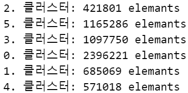
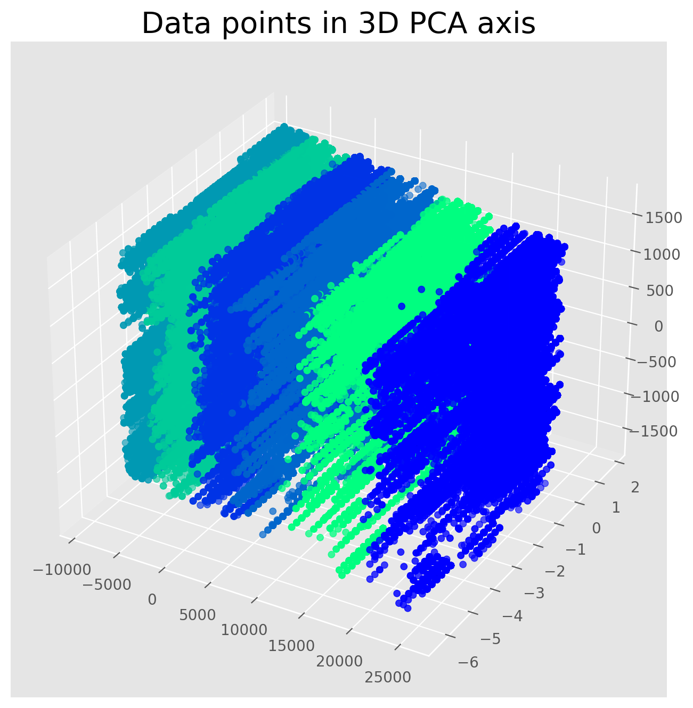
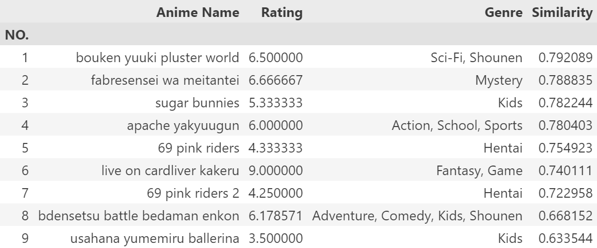
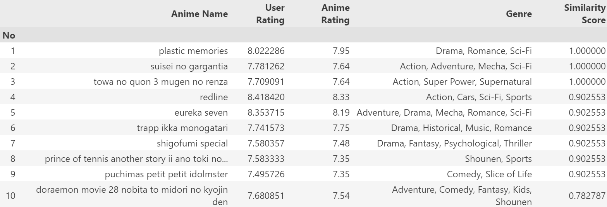
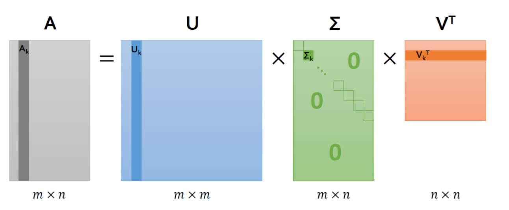
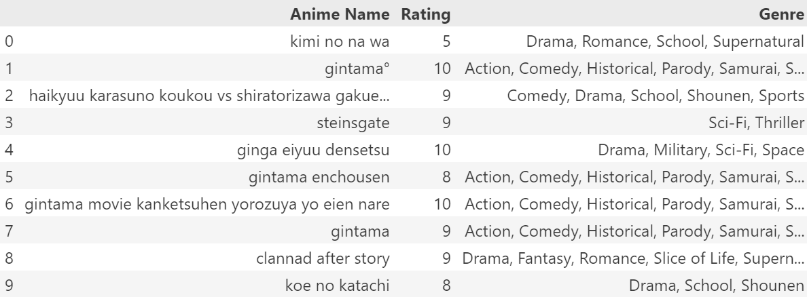
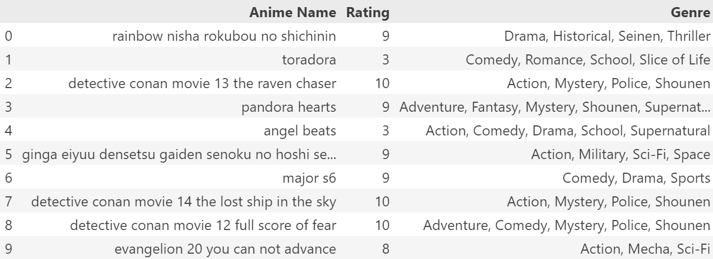

# 애니메이션 평가 데이터를 활용한 추천 시스템

## 프로젝트 소개

### 📖 프로젝트 목표
**1. 사용자의 취향을 반영 할 수 있는 서비스 제공**

- 다양한 추천 모델(kmeans, knn, 협업 필터링, 콘텐츠 기반 필터링, SVD, Hybrid) 를 사용하여 애니메이션과 고객별 평점을 분류하고 추후 사용자가 접하지 못했던 새로운 애니메이션을 추천하도록 한다.
- 이를 통해 사용자는 특정 장르나 유명 작품에 편중되지 않고 다양한 애니메이션을 접할 수 있다.

**2. 객관적인 평점 예측을 위한 시스템 구축**

- 기존의 추천 시스템은 단순히 사용자의 과거 선호도가 반영되었다.
- 본 프로젝트는 애니메이션의 다양한 특징(예: 장르, 방영 연도, 제작사, 인기 지표 등)을 기반으로 더욱 정교한 추천시스템을 구축하고자 했다.
 

### ⭐ 프로젝트 필요성
| **주제**                       | **내용**                                                                                   |
|---------------------------------|--------------------------------------------------------------------------------------------|
| **고객의 취향 발견**            | 이미 접한 애니메이션만 반복적으로 추천하는 시스템은 흥미롭지 않다. 애니메이션 고객 평점 기반으로 다양한 추천을 제공하는 시스템이 필요하다. 시청 가능한 애니메이션의 범위를 넓히고, 새로운 취향을 발견해보자 |
| **시장 경쟁력 확보를 위한 추천 시스템** | 콘텐츠 과잉 시대에서 추천 시스템의 경쟁력은 매우 중요한 요소이다. 사용자의 취향을 분석하고 새로운 콘텐츠를 발견할 수 있는 서비스를 통해, 기존의 단순히 '인기 있는 콘텐츠'만 추천하는 시스템을 넘어 사용자 이용 경험을 개선할 수 있다. 이를 통해 서비스 제공자 또한 차별화된 경쟁력을 확보할 수 있다. |

## 기술 스택
#### [데이터 시각화]

  
  
    
   
  
  
  
  

## 🔎 데이터

### Anime Dataset
* 12994 rows

| anime_id  | name            | genre        | type    | episodes | rating | members |
|-----------|-----------------|--------------|---------|----------|--------|---------|
| Unique ID | 애니메이션 이름 | 애니메이션 장르 | 방영 유형 | 에피소드 수 | 평균 평점 (10점 만점) | 커뮤니티 멤버 수 |

### Rating Dataset
* 7813737 rows

| user_id  | anime_id | rating |
|----------|----------|--------|
| 무작위 생성된 사용자 ID | 사용자가 평가한 애니메이션 ID | 사용자 평가 (10점 만점, -1은 미평가) |

-------

## 📚분석과정
## 1. Data Cleaning
- 누락 데이터 및 중복데이터 삭제

## 2. Data Preprocessing
- 데이터 merge & 컬럼 rename
  
[before cleaning]

[after cleaning]

- rating -1은 애니메이션을 시청함에도 평가하지 않은 데이터이므로 삭제

- 텍스트 정규화 (불용어 처리)
    - df[name] 컬럼의 모든 값에 clean_txt()을 지정해 텍스트 정규화 

---

## 🕶️ Appendix

---

## 3. 인기 기반 추천 모델 생성 

### [협업 필터링 추천 시스템]

: k-means를 활용하여 **특정 속성간 유사한 그룹으로 묶고** 그룹화된 데이터에서 특정 유저를 뽑아 **KNN의 코사인 유사도를 활용**하여 특정 유저 데이터와 근접한 애니메이션 추천

#### (1) 특정 속성 선택
- 전체 10개 속성 중 유의미한 속성인 genre, type 속성을 레이블 인코더를 통해 수치화
- 클러스터링을 수행할 때 사용할 특징 속성을 제외한 나머지 속성은 제거

  
One-Hot-Encoder 말고 레이블 인코더를 사용한 이유

  <ul>
    <li>텍스트 데이터를 처리하는데에는 메모리가 많이 사용되기에 수치화를 통해 텍스트 데이터를 숫자로 바꾸어 메모리 효율성을 올림</li>
    <li>데이터 값의 분포가 너무 다양하여 원핫인코더를 사용하면 속성이 대량으로 증가하고 이는 연산 속도가 대폭 감소함</li>
  </ul>

#### (2) K-means model 
- K-means는 비지도학습에 속하는 머신러닝 알고리즘으로 데이터를 K개의 군집(Cluster)으로 묶는(Clusting) 알고리즘이다.
- K = 6으로 설정하여 클러스터링을 수행
- 전체 6,337,145개의 데이터를 6개의 그룹으로 군집화 

#### (3) KNN model 
- KNN은 근접성을 사용하여 개별 데이터 포인트의 그룹화에 대한 분류 또는 예측을 수행하는 알고리즘이다.
- 6개의 그룹화된 데이터에서 랜덤으로 하나의 그룹을 선정
- 선정된 그룹내에서 랜덤한 유저를 추출
- KNN의 **코사인 유사**도 활용하여 해당 유저와 근접한 애니메이션 데이터 10개를 추출
- 즉, 특정 유저가 시청한 애니메이션 중 이와 근접한 애니메이션 10개를 추천

#### (4) 협업 필터링 추천 시스템의 장단점
|장점|단점|
|----|----|
|유저에 대한 데이터의 정보가 많을 수록 정확도가 증가|유저에 대한 정보가 없으면 정확한 추천 불가능|
---

### [콘텐츠 기반 추천 시스템]

: 해당 시스템은 유저가 아닌 특정 애니를 기준으로 장르 데이터를 수치화하고 코사인 유사도를 통해 가장 유사한 애니를 추출

#### (1) TF-IDF 및 장르 간 코사인 유사도 행렬 계산
- TF-IDF는 문서의 집합에서 한 단어가 얼마나 중요한지를 수치적으로 나타낸 기법이다.
- TF-IDF를 통해 각 에니메이션에 대한 장르 정보를 수치적으로 나타낸다.

#### (2) K-means 군집 내 데이터 추출 후 코사인 유사도를 통한 근접 데이터 추출
- 6개의 그룹화된 데이터에서 랜덤으로 하나의 그룹을 선정
- 선정된 그룹에서 특정 장르의 애니메이션 평점 평균과 모든 유저의 평점 평균을 구함
- TF-IDF를 통해 수치화된 장르 정보를 코사인 유사도를 활용하여 근접한 애니메이션 10개를 추천

#### (3) 추천 애니메이션 인덱스 저장 후 결과 가져오기 

#### (4) 콘텐츠 기반 추천 시스템의 장단점
|장점|단점|
|----|----|
|장르에 따른 새로운 애니 추천 가능|유저의 취향보다는 유사한 애니를 추천해주는 방식|
|유저 평점 없이도 추천가능| |
---

### [SVD (특이값 분해)를 이용한 추천 시스템]

: SVD는 행렬을 세 개의 행렬의 곱으로 분해하는 기법으로, 추천 시스템에서 널리 사용되는 기법 중 하나이다. 기본적으로 SVD는 대규모 행렬의 차원을 줄이면서 중요한 정보만 보존하는 역할을 한다.

#### (1) SVD 학습을 위한 데이터 정규화
- Reader를 통해 평점 데이터의 읽는 방식 지정하여 평점이 1점에서 10점 사이임을 나타낸다.
- SVD를 학습하면서 원본 데이터가 변형이 일어날 수 있기에 학습을 위한 원본 데이터의 복사본 생성
- Reader와 원본 데이터의 복사본을 통해 SVD의 입력으로 들어갈 데이터를 생성

#### (2) SVD를 이용한 추천 시스템
- 애니메이션에 대한 전체 데이터셋에서 사용자가 평점을 주지 않은 데이터뿐만 아니라 이외에 시청하지 않은 애니메이션 중 높은 평점을 받은 애니메이션 10개를 추출

#### (3) SVD를 이용한 추천 시스템의 장단점
|장점|단점|
|----|----|
|유저가 보지 않은 애니메이션도 추천 가능|전체 데이터셋에서 높은 평점을 받은 애니를 추천하다 보니 유저가 선호도가 석여서 원하는 속성(ex. 장르, 타입)이 아닌 그룹에 해당한 애니를 추천 받을 수 있음|

---

### [Hybrid(K-Means + SVD를 이용한 추천 시스템]

: 클러스터링된 6개의 그룹 내에서 SVD 모델을 사용하여 추천하는 시스템

#### (1) SVD 학습을 위한 데이터 정규화
- SVD를 이용한 추천 시스템과 같은 방법으로 정규화하지만 원본 데이터를 복사하는 것이 아닌 클러스터링된 데이터를 복사하여 Reader와 함께 SVD의 입력으로 들어갈 데이터 생성

#### (2) Hybrid(K-Means + SVD를 이용한 추천 시스템
- 애니메이션에 대한 전체 데이터셋이 아닌 특정 속성에 대해 그룹화된 데이터에서 사용자가 평점을 주지 않은 데이터뿐만 아니라 이외에 시청하지 않은 애니메이션 중 높은 평점을 받은 애니메이션 10개를 추출

#### (3) SVD를 이용한 추천 시스템의 장단점
|장점|단점|
|----|----|
|그룹화된 데이터 내에서 유저에 대한 세세한 정보를 통해 유저가 보지 않은 애니메이션 추천 가능|그룹화된 데이터 내에서만 추출하다보니 새로운 장르 또는 유저가 보고싶은 다른 타입의 애니메이션은 추천 불가능|

---
